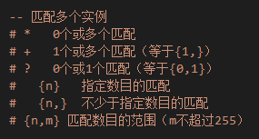
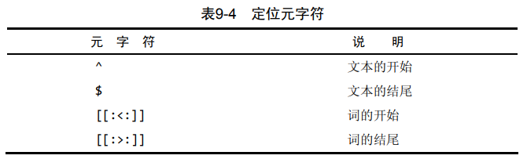
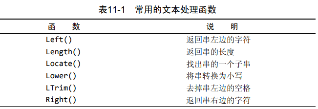
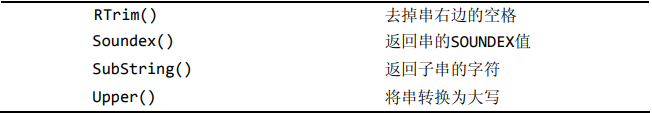
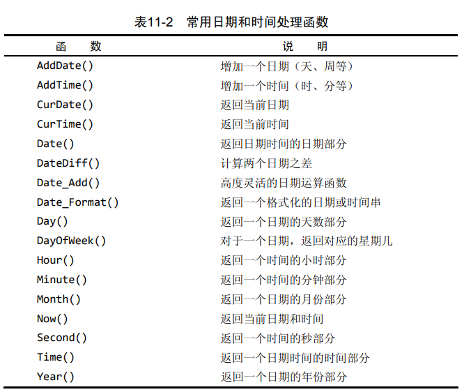
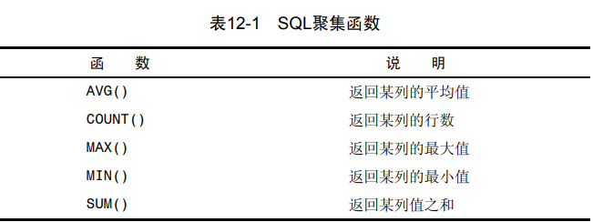

数据库定义:数据库是一个以某种有组织的方式存储的数据集合。

表:表是一种结构化的文件，可用来存储某种特定类型的数据。

模式:表具有一些特性，这些特性定义了数据在表中如何存储，如可以存
储什么样的数据，数据如何分解，各部分信息如何命名，等等。描述表
的这组信息就是所谓的模式，模式可以用来描述数据库中特定的表以及
整个数据库（和其中表的关系）。

列:表中的一个字段。所有表都是由一个或多个列组
成的。

行:表中的数据是按行存储的，所保存的每个记录存储在自己的行内。

主键:表中每一行都应该有可以唯一标识自己的一列（或一组列）。

主键是用来标识出唯一的行，如果没有主键，那么涉及到相关操作的时候，就有可能无法保证删除到正确的行。


## 主键设置规则

 任意两行都不具有相同的主键值；   
 每个行都必须具有一个主键值（主键列不允许NULL值）    
 不更新主键列中的值；    
 不重用主键列的值；    
 不在主键列中使用可能会更改的值。（例如，如果使用一个
名字作为主键以标识某个供应商，当该供应商合并和更改其
名字时，必须更改这个主键。）

## MySQL

数据的所有存储、
检索、管理和处理实际上是由数据库软件——DBMS（数据库管理系统）
完成的。MySQL是一种DBMS，即它是一种数据库软件。注意DBMS和数据库的概念完全不同

## 有用的命令行

SHOW COLUMNS FROM `表名` 列出表里所有的列  做代码生成器的时候可以用到    
DESCRIBE `表名` 列出表里所有的列  同上   
SHOW STATUS，用于显示广泛的服务器状态信息；   
SHOW CREATE DATABASE和SHOW CREATE TABLE，分别用来显示创建特定数据库或表的MySQL语句；   
SHOW GRANTS，用来显示授予用户（所有用户或特定用户）的安
全权限；   
SHOW ERRORS和SHOW WARNINGS，用来显示服务器错误或警告消息。    
mysql -h主机名  -u用户名 -p密码 连接数据库注意-p和密码之间没有空格   
退出:
```sql
quit
exit
\q
```

## 查询
- DISTINCT 排重关键字
  ```sql
  SELECT DISTINCT vend_idF FROM products
  SELECT DISTINCT vend_id,prod_price FROM `products`
  ```
  注意这个DISTINCT关键字作用与后面所有的列，后面跟着的所有列都一样才合并为一行，否在将分开显示

- limit 限制返回行数
  ```sql
  select prod_name from products limit 5,5; #从第 6 行开始，检索 5 行
  select prod_name from products limit 4 OFFSET 3; #从第 3 行开始，检索 4 行
  ```
  注意从mysql5.5之后新增了offset字段，目的是增强语义化。还有行数是从0开始的，limit5取得是第六行

- 使用完全限定的表名
  ```sql
  select products.prod_name from crashcourse.products;
  ```
- 排序 
  使用order by进行排序，默认asc升序排序，desc降序排序
  ```sql
  select prod_id, prod_price,prod_name 
  from products 
  order by prod_price desc, prod_name desc; #先按价格降序排列，再按产品名降序排列
  ```
  查询价格最高的商品(如果价格一样就有问题)，这个句子展示了limit必须在order by后面
  ```sql
  select prod_price from products order by prod_price desc limit 1; # 最高值 
  ```
- where 过滤数据   
  使用where字段过滤数据，除了常见的判断符，还有<>符号，表示不等
  ```sql
  select vend_id,prod_name from products where vend_id <> 1003; # 检索不是由1003供应商制造的所有产品 
  ```
  还有between范围值检查和null字符检查，这两个都用的少,注意这个is null，在数据库中null和''和0是由区分的，查询is null 那一列必须是null值
  ```sql
  select prod_name,prod_price from products where prod_price between 5 and 10; # 价格 大于等于5，小于等于10 的产品名、产品价格
  ```
  ```sql
  select prod_name from products where prod_price is null;  # 返回prod_price为空值null的prod_name,无对应数据 
  ```
- and 和 or   
  使用and和or进行where子句连接，但要注意，同时使用and，or时，查询是由顺序的，必须使用()将子句包裹起来。
  ```sql
  select prod_name,prod_price from products where vend_id = 1002 or vend_id = 1003; 
  ```
- in 和 not   
  in
  ```sql
  select prod_name,prod_price from products
  where vend_id in (1002,1003) order by prod_name;
  ```
  not
  ```sql
  select prod_name,prod_price from products
  where vend_id not in (1002,1003) order by prod_name;
  # Mysql支持not对in，between，exsits子句取反 
  ```
## 搜索

- 通配符搜索    
  使用%和_进行通配符搜索，%匹配多个字符，_匹配一个字符,使用like匹配字段中包含anvil，并且anvil出现的次数不受限制。
  ```sql
  select prod_id,prod_name from products where prod_name like "%anvil%"; 
  ```
  注意 % 不能匹配null值，并且将%放在句首将会拖慢搜索速度
- 正则表达式匹配
  mysql中也可以使用正则匹配，但是对于正则表达式的支持比较有限，这里只记录书中出现的

  在正则表达式中，匹配任意 一个 字符 
  ```sql
  select prod_name from products where prod_name regexp ".000";
  ```
  正则表达式匹配默认不分大小写，需使用BINARY区分大小写
  ```sql
  select prod_name from products where prod_name regexp binary "JetPack .000";
  ```
  正则表达式的OR操作符： |
  ```sql
  select prod_name from products where prod_name regexp "1000|2000" order by prod_name;
  ```
  正则表达式匹配几个字符之一 [ ]
  ```sql
  select prod_name from products where prod_name regexp '[123] Ton' order by prod_name;  # [123]匹配单一字符：1或2或3
  ```
  正则表达式匹配范围 
  ```sql
  select prod_name from products where prod_name regexp '[1-5] Ton' order by prod_name;  # [1-5]匹配1,2,3,4,5
  ```
  正则表达式匹配特殊字符，必须用\\前导，进行转义 
  多数正则使用单反斜杠转义，但mysql使用双反斜杠，mysql自己解释一个，正则表达式库解释一个
  ```sql
  select vend_name from vendors where vend_name regexp "\\." order by vend_name; # ‘\\.'匹配字符.
  ```
- 正则表达式匹配字符类    
  [:alnum:]	任意字母和数字（同[a-zA-Z0-9]） 
  [:alpha:]	任意字符（同[a-zA-Z]）    
  [:blank:]	空格和制表（同[\\t]）    
  [:cntrl:]	ASCII控制字符（ASCII 0到31和127）    
  [:digit:]	任意数字（同[0-9]）    
  [:graph:]	与[:print:]相同，但不包括空格 
  [:lower:]	任意小写字母（同[a-z]）    
  [:print:]	任意可打印字符 
  [:punct:]	既不在[:alnum:]又不在[:cntrl:]中的任意字符 
  [:space:]	包括空格在内的任意空白字符（同[\\f\\n\\r\\t\\v]）    
  [:upper:]	任意大写字母（同[A-Z]）    
  [:xdigit:]	任意十六进制数字（同[a-fA-F0-9]）    
  ```sql
  select prod_name from products where prod_name regexp '[:digit:]' order by prod_name; #[:digit:]匹配任意数字 
  ```

- 匹配多个实例 
  mysql正则中对于多个重复字符的支持   
  
  ```sql
  select prod_name from products where prod_name regexp '\\([0-9] sticks?\\)'
  order by prod_name;  # 返回了'TNT (1 stick)'和'TNT (5 sticks)'
  ```
- 定位符      
  
  ```sql
  select prod_name from products where prod_name regexp '^[0-9\\.]' order by prod_name; #找出以一个数（包括以小数点开始的数）开始的所有产品
  select prod_name from products where prod_name regexp '[0-9\\.]' order by prod_name;  #找出包括小数点和数字的所有产品
  ```
##  函数
- 拼接字段 concat()
  ```sql
  select concat(vend_name,' (',vend_country,')') from vendors order by vend_name; 
  ```
- 删除空格   
  删除数据左侧多余空格 ltrim()   
  删除数据两侧多余空格 trim()   
  删除数据右侧多余空格 rtrim()  
  ```sql
  select concat(rtrim(vend_name),' (',rtrim(vend_country),')') from vendors order by vend_name;
  ``` 

- as赋予别名
  ```sql
  select concat(rtrim(vend_name),' (',rtrim(vend_country),')') as vend_title from vendors order by vend_name;
  ```

- 执行算数计算    
  ```sql
  select prod_id,quantity,item_price from orderitems where order_num = 20005;
  ```

- 文本函数     
  
  
  
  ```sql
  select vend_name, upper(vend_name) as vend_name_upcase from vendors order by vend_name;
  ```
  soundex() 描述语音表示的字母数字模式的算法,对串按照发音比较而不是字母比较
  ```sql
  select cust_name,cust_contact from customers where cust_contact = 'Y. Lie';  # 无返回 
  select cust_name,cust_contact from customers where soundex(cust_contact) = soundex('Y. Lie'); # 按发音搜索 
  ```

- 日期函数    
  常用日期函数
       
  按照date()日期进行过滤信息，更可靠 
  ```sql
  select cust_id,order_num from orders where date(order_date) = "2005-09-01";
  ```
- 聚合函数   
  
  avg() 求和，忽略null
  ```sql
  select avg(prod_price) as avg_price from products;
  ```
  count() 对行的数目进行统计 忽略null
  ```sql
  select count(*) as num_cust from customers; 
  ```
  max() & min()  最大最小
  ```sql
  select max(prod_price) as max_price from products;
  select min(prod_price) as min_price from products;
  ```
  在用于文本数据时，如果数据按相应的列排序，则MIN()返回最前面一行
  ```sql
  select min(prod_name) from products; 
  ```
  sum 求和
  ```sql
  select sum(quantity) as items_ordered from orderitems;
  ```
  使用聚合函数时去重
  ```sql
  select avg(distinct prod_price) as avg_price from products where vend_id = 1003;
  ```
  在使用COUNT的使用指定条件，最后必须加上NULL，因为COUNT是不计算null的，如果这行数据的release_year不等于2006，那么就是返回null，而null不被计算，所以用这种方式进行筛选
  ```sql
  count(release_year = '2006' or NULL) 
  ```

## 分组函数
- ROLLUP关键字   
  使用WITH ROLLUP关键字，可以得到每个分组的汇总值，下述语句得到所有分组count(*)的和14
  ```sql
  select vend_id, count(*) as num_prods from products group by vend_id with rollup;
  ``` 
  查询结果，3+2+7+2 = 14
  ```
  1001	3
  1002	2
  1003	7
  1005	2
	      14
  ```
  值得注意的是，这个rollup可以配合coalesce函数其别名
  ```
- coalesce函数   
  coalesce(a,b,c);
参数说明：如果a==null,则选择b；如果b==null,则选择c；如果a!=null,则选择a；如果a b c 都为null ，则返回为null（没意义）。
  ```sql
  select coalesce(vend_id,"总供应商"), count(*) as num_prods from products group by vend_id with rollup;
  ```
  查询结果：
  ```
  1001	3
  1002	2
  1003	7
  1005	2
  总供应商	14
  ```
- having  
  和having组合使用
  ```sql
  select vend_id,count(*) as num_prods from products where prod_price >=10 group by vend_id having count(*)>=2;
  ```
  
## 子查询

- 作为计算字段使用子查询
  ```sql
  select cust_name,cust_state, (select count(*) from orders where orders.cust_id = customers.cust_id) as orders
  from customers order by cust_name;
  ```

## 连接表
- 联结   
  使用where字句联结两张表，这种使用where的方式，会去匹配每一个where中条件    
  ```sql
  select vend_name,prod_name,prod_price 
  from vendors,products
  where vendors.vend_id = products.vend_id
  order by vend_name,prod_name;
  ```
- 内部联结
  ```sql
  select vend_name,prod_name,prod_price 
  from vendors inner join products
  on vendors.vend_id = products.vend_id;
  ```

## 高级连接
- 表别名
  ```sql
  select cust_name,cust_contact 
  from customers as c,orders as o,orderitems as oi
  where c.cust_id = o.cust_id
  and oi.order_num = o.order_num
  and prod_id = 'TNT2';
  ```
- 自联结
  ```sql
  select p1.prod_id,p1.prod_name
  from products as p1, products as p2
  where p1.vend_id = p2.vend_id
  and p2.prod_id = 'DTNTR';
  ```

- 自然联结
  方法：通过对表使用通配符*，对所有其他表的列使用明确的子集,自然联结使每个列只返回一次
  ```sql
  select c.*,o.order_num,o.order_date,oi.prod_id,oi.quantity,oi.item_price
  from customers as c,orders as o,orderitems as oi
  where c.cust_id = o.cust_id
  and oi.order_num = o.order_num
  and prod_id = 'FB';
  ```
- 外部联结
  方法： 内部联结，这里的内部联结感觉取一个交集的感觉，里面的列必须是双方都有的。
  ```sql
  select customers.cust_id,orders.order_num
  from customers inner join orders
  on customers.cust_id = orders.cust_id;
  ```
- 左外部联结
  左外部联结,跟上一个内部联结放在一起谈，左外部联结更像以左边表的列为主体,去找右边的能够对应的数据
  ```sql
  select customers.cust_id,orders.order_num
  from customers left outer join orders
  on customers.cust_id = orders.cust_id;
  ```
- 右外部联结
  右联结与左联结相反，我发现这个联结这个词用得很恰当，因为本质是集合操作，没有多余的思想。
  ```sql
  select customers.cust_id,orders.order_num
  from customers right outer join orders
  on customers.cust_id = orders.cust_id;
  ```
- 带聚集函数的联结
  ```sql
  select customers.cust_name,
	   customers.cust_id,
     count(orders.order_num) as num_ord
  from customers inner join orders 
  on customers.cust_id = orders.cust_id
  group by customers.cust_id; 
  ```
  ```sql
  select customers.cust_name,
	   customers.cust_id,
       count(orders.order_num) as num_ord
  from customers left outer join orders 
  on customers.cust_id = orders.cust_id
  group by customers.cust_id; 
  ```
## 组合查询
- 使用union
  ```sql
  select vend_id,prod_id,prod_price from products where prod_price <=5
  union
  select vend_id,prod_id,prod_price from products where vend_id in (1001,1002);
  ```
  union在一张表的时候也可以用where来代替，但是使用多表的话，union感觉更好做一点。

- union all
  ```sql
  select vend_id,prod_id,prod_price from products where prod_price <=5
  union all
  select vend_id,prod_id,prod_price from products where vend_id in (1001,1002);
  ```
## 全文搜索
- match和against   
  ```sql
  select note_text from productnotes where match(note_text) against('rabbit');
  ```
  显示
  ```sql
  select note_text, match(note_text) against('rabbit') as 'rank' from productnotes; 
  ```

- 查询扩展
  ```sql
   select note_text from productnotes where match(note_text) against('anvils' with query expansion);
  ```

- 布尔搜索
  用来更灵活筛选全文搜索的结果
  ```sql
  布尔操作符			说明
  +				包含，词必须存在 
  -				排除，词必须不出现
  >				包含，而且增加等级值 
  <				包含，且减少等级值 
  ()				把词组成子表达式（允许这些表达式作为一个组被包含、排除、排列等）
  ~				取消一个词的排序值
  *				词尾的通配符
  “ ”				定义一个短语（与单个词的列表不一样，它匹配整个短语一边包含或排除这个短语）
  ```
  全文本搜索检索包含词heavy的所有行
  关键字IN BOOLEAN MODE，实际上没有指定布尔操作符，其结果与没有指定布尔方式的结果相同   
  ```sql
    select note_text from productnotes where match(note_text) against('heavy' in boolean mode);
  ```

  
  -rope* 排除包含rope*（任何以rope开始的词，包括ropes）的行  
  ```sql
    select note_text from productnotes where match(note_text) against('heavy -rope*' in boolean mode);
  ``` 
  匹配包含词rabbit和bait的行
  ```sql
  select note_text from productnotes where match(note_text) against('+rabbit +bait' in boolean mode);
  ```   
  不指定操作符，搜索匹配包含rabbit和bait中的至少一个词的行 
  ```sql
    select note_text from productnotes where match(note_text) against('rabbit bait' in boolean mode);
  ```  
  搜索匹配短语rabbit bait而不是匹配两个词rabbit和bait。 
  ```sql
    select note_text from productnotes where match(note_text) against('"rabbit bait"' in boolean mode);
  ```    
  匹配rabbit和carrot，增加前者的等级，降低后者的等级
  ```sql
    select note_text from productnotes where match(note_text) against('>rabbit <carrot' in boolean mode);
  ```   
  必须匹配词safe和combination，降低后者的等级
  ```sql
  select note_text from productnotes where match(note_text) against('+safe +(<combination)' in boolean mode);
  ```   

## 插入
  - 单个插入
    插入的时候指定列名
    ```sql
    insert into customers (cust_name,cust_address,cust_city,cust_state,cust_zip,cust_country,cust_contact,cust_email)
    values ('Pep E. LaPew','100 Main Street','Los Angeles','CA','90046','USA',NULL,NULL);
    ```
  - 批量插入
    ```sql
    # 方法一：多个insert的语句
    insert into customers(cust_name,cust_address,cust_city,cust_state,cust_zip,cust_country)
    values('Pep E. LaPew','100 Main Street','Los Angeles','CA','90046','USA');
    insert into customers(cust_name,cust_address,cust_city,cust_state,cust_zip,cust_country)
    values('M. Martian','42 Galaxy Way','New York','NY','11213','USA');
    ```
    ```sql
    # 方法二：多个insert的语句
    insert into customers(cust_name,cust_address,cust_city,cust_state,cust_zip,cust_country)
    values('Pep E. LaPew','100 Main Street','Los Angeles','CA','90046','USA'),('M. Martian','42 Galaxy Way','New York','NY','11213','USA');
    ```

  - insert selec
    插入查询出来的值
    ```sql
    insert into customers (cust_contact,cust_email,cust_name,cust_address,cust_city,cust_state,cust_zip,cust_country)
    select cust_contact,cust_email,cust_name,cust_address,cust_city,cust_state,cust_zip,cust_country from custnew;
    ```

 ## 更新和删除
  - 更新
    ```sql
    UPDATE customers 
    SET cust_name = 'The Fudds',
        cust_email = 'elmer@fudd.com'
    WHERE cust_id = 10005;
    ```

  - 删除
    ```sql
    delete from customers where cust_id = 10006;
    ```
    如果想从表中删除 所有行，不要使用DELETE，可使用TRUNCATE TABLE语句
    TRUNCATE实际是删除原来的表并重新创建一个表，而不是逐行删除表中的数据

## 表操作
- 新建表
  ```sql
  CREATE TABLE customers
  (
    cust_id      int       NOT NULL AUTO_INCREMENT,
    cust_name    char(50)  NOT NULL ,
    cust_address char(50)  NULL ,
    cust_city    char(50)  NULL ,
    cust_state   char(5)   NULL ,
    cust_zip     char(10)  NULL ,
    cust_country char(50)  NULL ,
    cust_contact char(50)  NULL ,
    cust_email   char(255) NULL ,
    PRIMARY KEY (cust_id)
  ) ENGINE=InnoDB;
  ```
- 添加列
  给vendors表增加一个名为vend_phone的列
  ```sql
  alter table vendors 
  add vend_phone char(20);
  ```
  删除列
  ```sql
  alter table vendors
  drop column vend_phone;
  ```
  定义外键
  ```sql
  ALTER TABLE orderitems ADD CONSTRAINT fk_orderitems_orders FOREIGN KEY (order_num) REFERENCES orders (order_num);
  ```
- 删除表
  ```sql
  drop table customers2;
  ```
- 重命名表
  ```sql
  rename table backup_customers to customer,
	backup_vendors to vendors,
  backup_products to products;
  ```  
## 视图操作
  - 创建视图
    ```sql
    create view productcustomers as
    select cust_name,cust_contact,prod_id
    from customers,orders,orderitems
    where customers.cust_id = orders.cust_id
    and orders.order_num = orderitems.order_num;
    ```

## 存储过程
  - 创建存储过程
    delimiter //表明使用//作为语句的结尾符，因为使用；在命令行状态下会报错
    ```sql
    delimiter //
    create procedure productpricing()
    begin
      select avg(prod_price) as priceaverage from products;
    end
    ```
  - 调用存储过程
    ```sql
    call productpricing();
    ```
  - 删除存储过程
    ```sql
    drop procedure productpricing;
    ```
  - 使用参数out
    调用存储过程并不会直接返回数据，必须传入out参数，将结果赋值out参数
    ```sql
    delimiter //
    create procedure productpricing(out pl decimal(8,2), out ph decimal(8,2), out pa decimal(8,2))
    begin
      select min(prod_price) into pl from products;
        select max(prod_price) into ph from products;
      select avg(prod_price) into pa from products;
    end //
    ```
    ```sql
    call productpricing(@pricelow,@pricehigh,@priceaverage);
    select @pricehigh,@pricelow,@priceaverage;
    ```
  - 参数值in 额out
    in参数代表传入值和out相反
    ```sql
    delimiter //
    create procedure ordertotal(
      in onumber int,   				# onumber定义为IN，因为订单号被传入存储过程
        out ototal decimal(8,2)			# ototal为OUT，因为要从存储过程返回合计
    )
    begin
      select sum(item_price*quantity) from orderitems 
        where order_num = onumber
        into ototal;
    end //
    ```
    ```sql
    call ordertotal(20009,@total);
    select @total;
    ```
  - 复杂存储过程
    ```sql
    delimiter //
    create procedure ordertotal(
      in onumber int,
      in taxable boolean,
        out ototal decimal(8,2)
    ) comment 'obtain order total, optionally adding tax'
    begin
      -- declare variable for total 定义局部变量total
        declare total decimal(8,2);
        -- declare tax percentage 定义局部变量税率 
        declare taxrate int default 6;
        -- get the order total 获得订单合计
      SELECT SUM(item_price * quantity)
      FROM orderitems
      WHERE order_num = onumber INTO total;
      -- is this taxable? 是否要增加营业税？ 
      if taxable then
        -- Yes,so add taxrate to the total 给订单合计增加税率
        select total+(total/100*taxrate) into total;
      end if;
      -- and finally,save to out variable 最后，传递给输出变量 
      SELECT total INTO ototal;
    END //
    ```
    调用
    ```sql
    # 调用上述存储过程，不加税 
    call ordertotal(20005,0,@total);
    select @total;
    # 调用上述存储过程，加税 
    call ordertotal(20005,1,@total);
    select @total;
    ```
  - 存储过程信息
    ```sql
    # 获得包括何时、由谁创建等详细信息的存储过程列表
    # 该语句列出所有存储过程
    show procedure status;
    # 过滤模式 
    show procedure status like 'ordertotal';
    ```
  ## 使用游标
    感觉这个游标只是说可以把一些业务操作放到数据库里，其他的作用还没看到
  - 创建游标
    ```sql
    delimiter //
    create procedure processorders()
    begin
      -- decalre the cursor 声明游标 
      declare ordernumbers cursor
        for
        select order_num from orders;
        
      -- open the cursor 打开游标
      open ordernumbers;
      -- close the cursor 关闭游标
      close ordernumbers;
      end //
    ```
  - 使用游标
    ```sql
    delimiter //
    create procedure processorders()
    begin

	  -- declare local variables 声明局部变量
    declare o int;
    
    -- decalre the cursor 声明游标 
	  declare ordernumbers cursor
    for
    select order_num from orders;
    
	  -- open the cursor 打开游标
	  open ordernumbers;
    
    -- get order number 获得订单号 
    fetch ordernumbers into o;
    /*fetch检索 当前行 的order_num列（将自动从第一行开始）到一个名为o的局部声明变量中。
    对检索出的数据不做任何处理。*/
        
	  -- close the cursor 关闭游标
	  close ordernumbers;

    END //
    ```
## 触发器
  - 创建触发器
    ```sql
    create trigger newproduct after insert on products for each row select 'product added' into @new_pro;
    # mysql 5.0以上版本在TRIGGER中不能返回结果集，定义了变量 @new_pro;
    insert into products(prod_id,vend_id,prod_name,prod_price) values ('ANVNEW','1005','3 ton anvil','6.09'); # 插入一行 
    select @new_pro;  # 显示Product added消息
    ```
  - 删除触发器
    ```sql
    drop trigger newproduct;
    ```
  - 使用触发器
    ```sql
    # insert触发器
    create trigger neworder after insert on orders for each row select new.order_num into @order_num;
    insert into orders(order_date,cust_id) values (now(),10001);
    select @order_num;
    ```
  - delete触发器
    ``` sql
    delimiter //
    create trigger deleteorder before delete on orders for each row
    begin
      insert into archive_orders(order_num,order_date,cust_id)
        values(old.order_num,old.order_date,old.cust_id); # 引用一个名为OLD的虚拟表，访问被删除的行
    end //
    ```
  - update触发器
    ```sql
    # update触发器
    # 在更新vendors表中的vend_state值时，插入前先修改为大写格式 
    create trigger updatevendor before update on vendors 
    for each row set new.vend_state = upper(new.vend_state);
    # 更新1001供应商的州为china
    update vendors set vend_state = 'china' where vend_id =1001;
    # 查看update后数据，1001供应商对应的vend_state自动更新为大写的CHINA
    select * from vendors;
    ```
## 事务管理
  - 基本概念

    1. 事务 transaction 指一组sql语句
    2. 回退 rollback 指撤销指定sql语句的过程
    3. 提交 commit 指将未存储的sql语句结果写入数据库表
    4. 保留点 savepoint 指事务处理中设置的临时占位符，可以对它发布回退（与回退整个事务处理不同）
  
  - 事务操作
    ```sql
    -- 控制事务处理
    # 开始事务及回退 
    select * from ordertotals;   # 查看ordertotals表显示不为空
    start transaction;  		 # 开始事务处理 
    delete from ordertotals;     # 删除ordertotals表中所有行
    select * from ordertotals;   # 查看ordertotals表显示 为空
    rollback;				     # rollback语句回退 
    select * from ordertotals;   # rollback后，再次查看ordertotals表显示不为空

    # commit 提交 
    start transaction;
    delete from orderitems where order_num = 20010;
    delete from orders where order_num = 20010;
    commit;   # 仅在上述两条语句不出错时写出更改 

    # savepoint 保留点 
    # 创建保留点
    savepoint delete1;
    # 回退到保留点 
    rollback to delete1;
    # 释放保留点 
    release savepoint delete1;
    ```
## 全球化和本地化

  - 字符集和校对顺序
    查看所支持的字符集完整列表
    ```sql
    show character set;
    ```
    查看所支持校对的完整列表,以及它们适用的字符集
    ```sql
    show collation;
    ```
    确定所用系统的字符集和校对
    ```sql
    show variables like 'character%';
    show variables like 'collation%';
    ```
    指定字符集
    ```sql
    create table mytable
    (
      column1 int,
        column2 varchar(10)
    ) default character set hebrew 
      collate hebrew_general_ci;
    ```
    除了能指定字符集和校对的表范围外，MySQL还允许对每个列设置它们
    ```sql
    create table mytable
    (
      column1 int,
        column2 varchar(10),
        column3 varchar(10) character set latin1 collate latin1_general_ci
    )default character set hebrew 
    collate hebrew_general_ci;
    ```
    查询时指定顺序
    ```sql
    select * from customers order by lastname,firstname collate latin1_general_cs;
    ```
## 安全管理
  - 管理用户
    ```sql
    use mysql;
    select user from user;
    ```
  - 创建用户账户
    创建用户设置密码
    ```sql
    create user ben identified by 'p@$$w0rd';
    ```
    重命名一个用户账户
    ```sql
    rename user ben to bforta;
    ```
    删除用户
    ```sql
    drop user bforta;
    ```
    查看赋予用户账号的权限
    ```sql
    show grants for bforta;
    ```
    操作权限
    ```sql
    grant select on crashcourse.* to bforta;
    ```
    撤销权限
    ```sql
    revoke select on crashcourse.* from bforta;
    ```
    简化授权
    ```sql
    grant select,insert on crashcourse.* to bforta;
    ```
    重新设置密码
    ```sql
    set password = 'n3w p@$$w0rd';
    ```
## 数据库维护
  - 分析表
    ```sql
    analyze table orders;
    ```
  - 检查表是否存在错误
    ```sql
    check table orders,orderitems;
    check table orders,orderitems quick; # QUICK只进行快速扫描
    ```
  - 优化表OPTIMIZE TABLE，消除删除和更新造成的磁盘碎片，从而减少空间的浪费
    ```sql
    optimize table orders;
    ```


 

  
