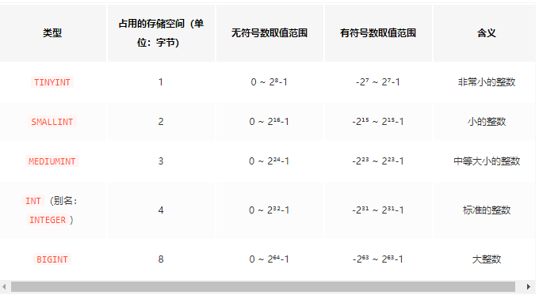
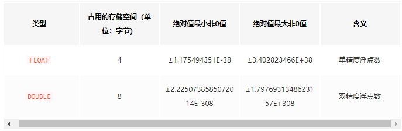
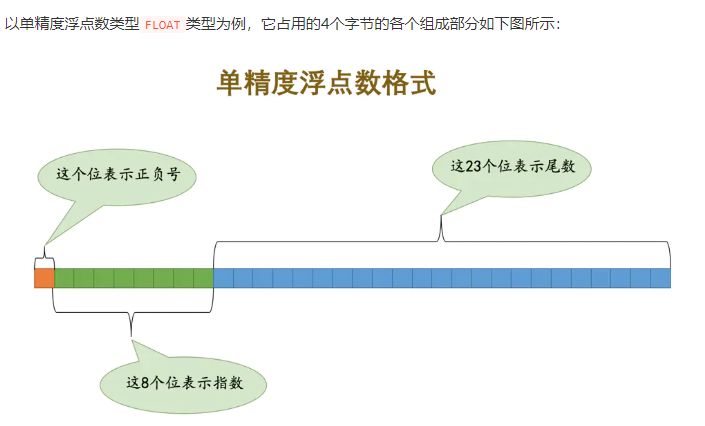
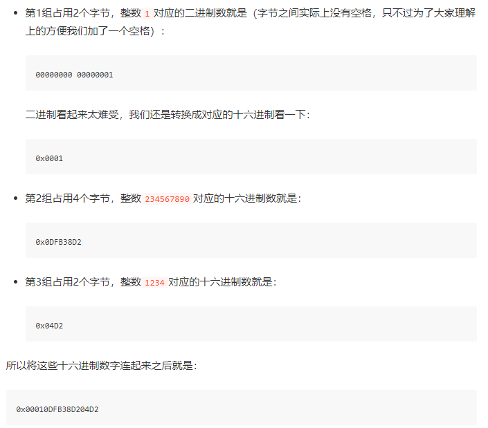
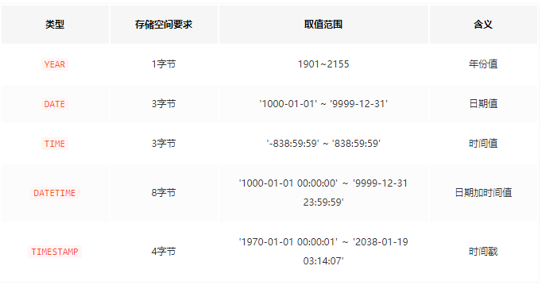
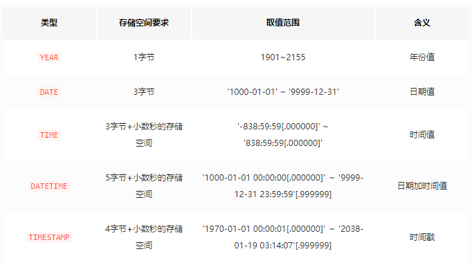
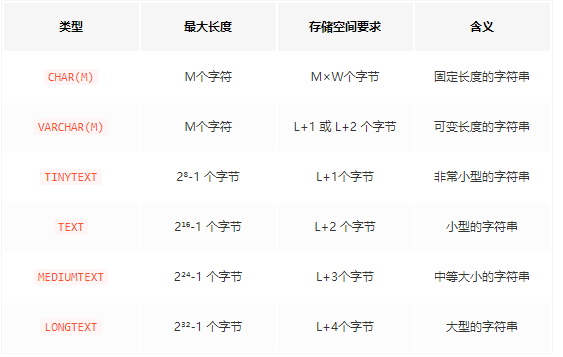
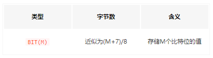

## 整数类型
整数类型在mysql中分为五种种，对应的不同的范围

## 浮点数类型

浮点数分为单精度和双精度，注意由于浮点数是采用十进制直接转二进制的存储方式，如果遇到超出位数的二进制会截断长度，所以无法准确记录多小数的数字。

以单精度为例,一旦超过23位小数，就会自动截断。

## 定点数类型
DECIMAL(M, D)类型，能够存储精度更高的数据M是存储的总位数，D是存储小数的位数，和浮点数不同的是，定点数无论小数还是整数部分都单独存储，M默认是十个字节，D默认是0
例如1234567890.1234，定点数首先存储会从小数点开始每九个数字为一组，这里就分为三组
小数点前第一组234567890 第二组1 小数点后1234 如图所示:

如果想表示负数，就直接对每一位取反即可。
## 无符号数值类型

UNSIGNED表示数字类型无符号
INT UNSIGNED就表示无符号整数，
FLOAT UNSIGNED表示无符号浮点数，
DECIMAL UNSIGNED表示无符号定点数。

## 时间类型
mysql中存储的时间类型，注意mysql在5.4之后的版本里可以记录微妙，如果使用微妙的话，在正常的存储空间中还要加上微秒的空间，如图2

## 字符串类型
字符串分为字节和字符，字节是计算机底层的结构，字符是面对人的概念，字符就是平常使用的语言符号什么的，想要将字符转化为字节需要将特定的2进制转为字符，这个过程就是编码，mysql中utf-8是阉割版的utf-8方案，只用了3个字节存储字符，想使用完整版请使用utf-8mb4

## ENUM类型和SET类型
枚举类型比较少用到，都会提前定义相对应的类型。
ENUM和SET类型都是一种特殊的字符串类型，在从字符串列表中单选或多选元素的时候会用得到它们

## 二进制类型
存储bit位数据   

以及BINARY(M)与VARBINARY(M)都是针对二进制存储的数据类型
