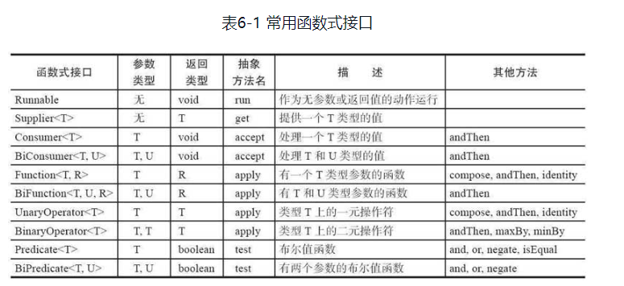

## 函数式接口
对于只有一个抽象方法的接口，需要这种接口的对象时，就可以提供一个lambda表达式。这种接口称为函数式接口（functional interface）

java8之后一个方法内可以传递lambda表示式，在java.util.function包中有一个尤其有用的接口Predicate，在ArrayList中removeIf方法就可以传递lambda表达式。
```java
public boolean removeIf(Predicate<? super E> filter)
```
## 方法引用

java8除了传递自己写的代码块以外，还可以利用现成的方法要传递到其他代码。下面的使用：：应用println方法。
```java
Timer timer = new Timer(1000,System.out::println);
```
在java核心卷中总结了三种情况  
·object：：instanceMethod // 对象的方法   
·Class：：staticMethod // 类的静态方法   
·Class：：instanceMethod   //类的方法

前面两种等价于直接调用如下方法，默认参数直接传递
```java
Timer timer2 = new Timer(1000,event -> System.out.println(event));
```
第三种相当于如下方法：
```java
String：：compareToIgnoreCase 等价于 （x，y）->x.compareToIgnoreCase（y）
```

## 构造器引用
跟方法引用差不多，只不过引用的是构造器。
```java
Employee [] employees = stream.toArrays(Employee::new);
```

## 编写lambda方法
想要参数使用lambda表达式，需要选择一个函数式接口作为参数，下图是函数式接口列表。

也可以自己定义一个函数式接口
```java
//函数式接口
public interface IntConsumer {

    void accept(int value);
}
//接受lambda的方法
public static void repeat(int n,IntConsumer action){
    for (int i = 0;i <n;i++){
        action.accept(i);
    }
}
//调用
repeat(10,i -> System.out.println(9-i));
```
## 代理


