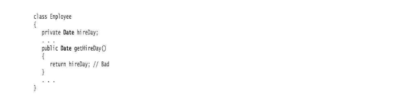
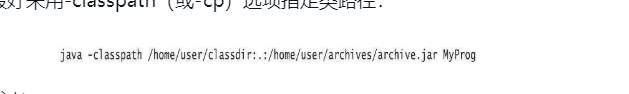

## 更改器和访问器方法

很早就知道，java的方法有些会返回一个新的对象，有些会修改原来的对象，在java中前者叫访问器方法(accessor method)，后者叫更改器方法(mutatormethod)

## 显式参数和隐式参数
方法中的显式参数指的就是调用方法传进来的参数，隐式参数指的是调用的那个对象，例如下面这个number007，在方法内部就可以用this指向这个number007对象的字段


## 封装问题
不要在get方法中方法一个可变对象，例如下图,这个Date对象时可以通过setTime()进行改变的，也就说如果通过get方法或了这个hireDay，再通过setTime改变值，一不规范，二如果出现问题不好排查



## 按值调用和按引用调用
参数调用分为两种，按值调用，每次参数传递只是传递参数对应的值，按引用调用，每次参数传递的都是对象的引用，前者如果修改参数，不会对原来的值产生影响，后者则会产生影响。例如下面这种情况，x的增加只会在参数内部有效，并不会传递到原来的参数值上。
```java
public void add(int x){
  x+=1
}
```
上述的情况针对的是基本类型，如果是对象引用，那么相对应的值还是会修改,其实说到底还是值引用，这个x被初始化为原本参数的一个拷贝，但是java中所有对象都是指向原本堆中真正的对象，所以这个x也被指向了堆中的对象，当x修改的时候，堆中的对象也修改了。
```java
public void add(User x){
  x.age=24
}
```

## 构造器和对象初始化
对象的初始化是使用构造器完成的，但我们没有自定义构造器的时候，java编译器会默认一个无参数的构造器，其次java还有初始化块的语法,就是两个大括号。
```
{

}
```
除此之外还可以设置为静态的,那么所有的对象都会拥有这一个语句块
```java
static{

}
```
由于类的初始化很复杂，贴一下初始化一个类的顺序,构造器是最后一个运行的。
```
1）所有数据域被初始化为默认值（0、false或null）。
2）按照在类声明中出现的次序，依次执行所有域初始化语句和初始化块。
3）如果构造器第一行调用了第二个构造器，则执行第二个构造器主体。
4）执行这个构造器的主体。
```

## 类路径
首先区分java编译器和java虚拟机，java编译器需要的是文件路径，只有通过文件路径才可以找到相对应的.java文件，而java虚拟机只有类系统，也就是说只有java编译器编译好后的class文件才有效，没有文件路径的概念，所以需要通过classpath命令指定类路径，其次，使用.可以指定从当前目录下开始查找类路径。
