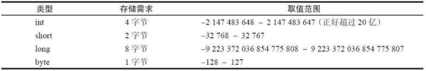
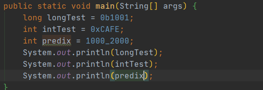

# Java中的基础数据类型
Java中的基础数据类型一共有8钟，其中有4种整型、2种浮点类型、1种用于表示Unicode编码的字符单元的字符类型char（请参见论述char类型的章节）和1种用于表示真值的boolean类型
## 整型
整型用来存储没有小数部分的整数，
四种整型，int，long，byte，short类型，分别对应了不同的长度和场景

byte经常用于图片操作的时候使用，short用的地方很少，除此之后，在使用整型的时候还可以尝试加入0b表示二进制，0x表示16进制，数字和数字之前可以使用_表示分割   

