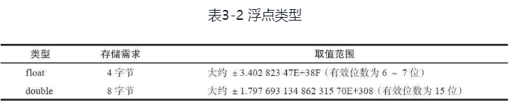
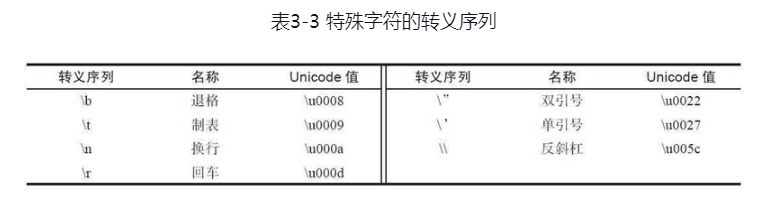
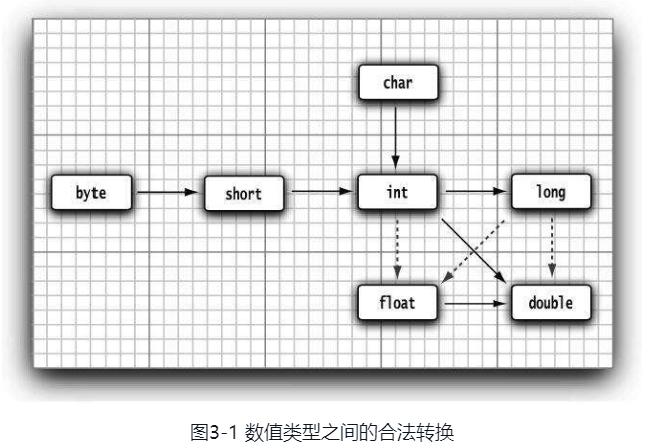

# Java中的基础数据类型
Java中的基础数据类型一共有8钟，其中有4种整型、2种浮点类型、1种用于表示Unicode编码的字符单元的字符类型char（请参见论述char类型的章节）和1种用于表示真值的boolean类型
## 整型
整型用来存储没有小数部分的整数，
四种整型，int，long，byte，short类型，分别对应了不同的长度和场景

byte经常用于图片操作的时候使用，short用的地方很少，除此之后，在使用整型的时候还可以尝试加入0b表示二进制，0x表示16进制，数字和数字之前可以使用_表示分割   


## 浮点类型
java中专门用来表示有小数部分的值,分为float和double类型，double是双精度类型，float是单精度类型，大部分情况下使用double类型。

注意的是，无论是double和float都会把误差舍去，所以不适合用于金融计算。

## char类型
char类型用来表示单个字符，但是有些Unicode符需要两个char类型的值来表示。除了表示字符外，还可以表示特殊字符的转义字符


## boolean类型
boolean（布尔）类型有两个值：false和true，用来判定逻辑条件。

## 类型转换
java中各个基础数据类型转换如下图所示，实心箭头代表不会损失精度，虚线箭头则相反。


## 操作符 
- 位移操作符   
  \>>和<<运算符将位模式左移或右移。需要建立位模式来完成位掩码时，这两个运算符会很方便：
  ```sql
  int a = 4;
  System.out.println(a>>1);
  ```
  4的位模式是0100，向左移1，相当于处于2，<<符号相当于乘与2，注意这里的/>>和<<都是有符号移动，正数时补0，负数时补1
  \>>>无符号右移符

- 字符串
  字符串的储存是存在堆中的，相当内容的字符串指向的是同一个字符串，java会把所有用到的字符串放进字符串池子里。

## 大数值
  java中提供BigInteger和BigDecimal。这两个类可以处理包含任意长度数字序列的数值。BigInteger类实现了任意精度的整数运算，BigDecimal实现了任意精度的浮点数运算。
  但是这两个类不能使用运算符直接运算，只能使用方法进行计算。