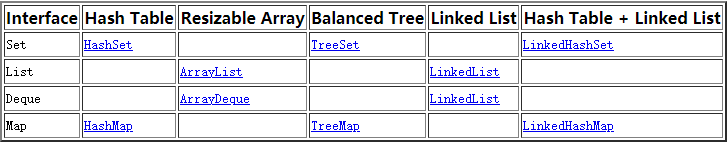

# 数据机构和算法

打算花一年的时间着重学习数据结构和算法，具体学习方法如下:    
<<<<<<< HEAD
首先通过自己动手实现数据结构的方式（JAVA）来学习数据结构   
第二阶段刷题我一直坚信计算机科学是一门动手的学科，任何知识都需要实际应用

## Java中的集合Overview
在jdk文档中oracle已经把所有已经实现好的数据结构分类好

=======
首先通过自己动手实现数据结构的方式（JAVA）来学习数据结构
第二阶段刷题我一直坚信计算机科学是一门动手的学科，任何知识都需要实际应用

>>>>>>> 53052041d76d73c048d4b0bdcaf24215ef04f96e

