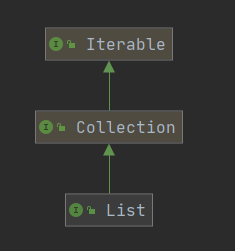
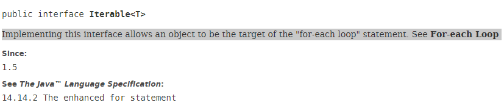

# 线性表
线性表几乎是开发中最经常使用的数据结构，在开始学习之前，我想总结一下，为什么我们需要线性表，引用书中的需求，怎么存储班上的所有学生的信息，并且每个人通过报数能够找到下一个人的位置，所以我们需要一种结构来存储一个有序的集合，这个集合的每一个节点必须存储下一个节点的位置(因为我们有查找下一个的需求，线性表才会存储下一个地址)

## 定义
线性表: 零个或多个元素的有限序列，每一个元素都有对应的顺序的。

## 抽象数据结构

抽象数据结构就是一个数据机构拥有哪些方法，数据的定义是什么，在Java中，我只理解成一个接口，比如所有的ArrayList都实现了List接口，这和list接口就相当于抽象数据结构

## Java中的实现

进入List接口，发现List继承了Collection以及间接集成了Iterable，如下图
   

Iterable是实现foreach循环的接口,具体的可以直接看文档


Collection是比较重要的接口，几乎是所有的集合具体实现的父接口，在Java文档中已经有比较详细的介绍，在这里只记录比较关键的点。    
[Java中Collection的总体介绍](https://docs.oracle.com/javase/tutorial/collections/interfaces/collection.html)

Collection在循环的时候实现删除元素，在之前有一次我使用for循环和foreach循环的时候，一边循环一边删除时失败了，当时没有深究过这个原因，但今天看文档的时候意外发现，在Collection文档中，已经说明当我们使用foreach循环的时候，使用删除等命令都会引起ConcurrentModificationException错误，现在从源代码的角度看一下是为什么引起这个错误。测试代码如下:
```java
String []a=new String[3];
        a[0] = "3";
        a[1] = "4";
        a[2] = "5";

        List<String> list = new ArrayList<>(Arrays.asList(a));
        for (String el:list){
            if (el.equals("5")){
                list.remove(el);
            }
        }
```
反编译class文件,发现foreach底层调用了list的iterator方法，返回一个iterator，点击去发现ArrayList里自己实现了iterator类，贴出相对应的代码
```java
String[] a = new String[]{"3", "4", "5"};
        List<String> list = new ArrayList(Arrays.asList(a));
        Iterator var3 = list.iterator();

        while(var3.hasNext()) {
            String el = (String)var3.next();
            if (el.equals("5")) {
                list.remove(el);
            }
        }

        System.out.println(list.toString());
```
```java
public boolean hasNext() {
            return cursor != size;
        }

        @SuppressWarnings("unchecked")
        public E next() {
            checkForComodification();
            int i = cursor;
            if (i >= size)
                throw new NoSuchElementException();
            Object[] elementData = ArrayList.this.elementData;
            if (i >= elementData.length)
                throw new ConcurrentModificationException();
            cursor = i + 1;
            return (E) elementData[lastRet = i];
        }
```
发现在checkForComodification()方法和游标(cursor)超过数组长度的时候都会报ConcurrentModificationException();在这个方法和checkForComodification()打个断点
```java
final void checkForComodification() {
            if (modCount != expectedModCount)
                throw new ConcurrentModificationException();
        }
```
然后我们看下remove方法，进入remove方法，发现其核心方法为fastremove，在其方法上打个断点
```java
private void fastRemove(int index) {
        modCount++;
        int numMoved = size - index - 1;
        if (numMoved > 0)
            System.arraycopy(elementData, index+1, elementData, index,
                             numMoved);
        elementData[--size] = null; // clear to let GC do its work
    }
```
这里面有个modCount++的操作，这个modCount在checkForComodification方法中会引发相关错误，这个modCount是继承AbstractList，进入文档，发现更为详细的信息，下面这段话的大致意思就是这个modCount值时专门用来记录列表修改的次数的，如果发生类似于修改，增加等相关操作，都会使这个数值发生变化，然后就会抛出ConcurrentModificationException这个错误。   

The number of times this list has been structurally modified. Structural modifications are those that change the size of the list, or otherwise perturb it in such a fashion that iterations in progress may yield incorrect results.
This field is used by the iterator and list iterator implementation returned by the iterator and listIterator methods. If the value of this field changes unexpectedly, the iterator (or list iterator) will throw a ConcurrentModificationException in response to the next, remove, previous, set or add operations. This provides fail-fast behavior, rather than non-deterministic behavior in the face of concurrent modification during iteration.   

后面又试着debug，发现只有当我把要删除的数字改为4之后就不报错了，也就是说当改为4之后，list的size和游标相当，size原本是3，但是删除一个元素，size变为2，而4的index就为2，hasNext就为false，跳出循环，不在调用next方法，如果把remove缓存add，无论是哪个数字都会报错。

