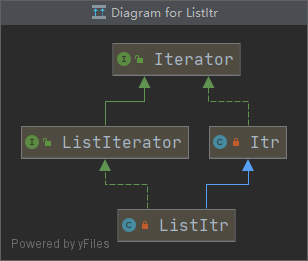

# 线性表(2)

[上一篇]()研究了一下Collection接口，这一篇继续阅读Java文档中的List接口，除了一些常规的例如查询之类的不记录，记录一下我之前一直没有用过的ListIterator.
[List文档](https://docs.oracle.com/javase/tutorial/collections/interfaces/list.html)

首先文档里描述的是这个ListIterator是比iterator效果更好的实现，并且和iterator不同的是，在ListIterator中游标指向的两个元素之间，如图；

这意味着这个iterator可以同时指向前后，不仅仅可以顺序循环，还可以逆序循环，首先讲顺序循环，注意由于游标指向的不再是当前的元素，而是中间区域，listIterator分为nextIndex和previousIndex两种表示位置的方法，并且也有hasNext和hasPreviousIndex方法。
```java
 ArrayList<String> list1 = new ArrayList<>();
        list1.add("1");
        list1.add("2");
        list1.add("3");
        list1.add("4");
        list1.add("5");
        ListIterator<String> it = list1.listIterator();

        while (it.hasNext()){
            System.out.println(it.previousIndex());
            System.out.println(it.nextIndex());
            System.out.println(it.next());
        }
```
还有一点，在普通的iterator中，游标是自动加1的，但在ListIterator中，手动调用next和previous方法，上面代码的输入如下：
```java
-1
0
1
0
1
2
1
2
3
2
3
4
3
4
5
```
当刚开始的时候，游标处于第一个元素前，所以前一个index是-1，nextIndex是0，调用next方法会返回下一个元素的内容，内容是1.剩下的元素内容以此类推。下面是逆序循环:
```java
while (it.hasPrevious()){
            System.out.println(it.nextIndex());
            System.out.println(it.previousIndex());
            System.out.println(it.previous());
        }
```
```java
5
4
5
4
3
4
3
2
3
2
1
2
1
0
1
```
当刚开始时，nextIndex指向5，虽然没有index为5没有内容，但是ListItertor也没有做限制，previousIndex指向位置4，previous方法返回元素5，剩下以此类推。

## ListItertor的操作

我们看一下ListItertor的类图关系，在ArrayList中，ListItr是ListIterator的实现类，并且继承于Itr，也就是说也拥有Iterator相关的方法，这里不再深究，只记录一下ListItr特有的方法。   
    

直接上代码，ListerIterator只有两个特有方法，set和add，set相当于重新设置该位置元素，add就是添加元素。注意不管是set还是add，都是针对调用next和precious后的值，比如下面这个代码,当调用了next之后，再去add("1"),那么这个1出现在的是原本元素1之后，改变的时候游标之后或者之前的值。
```java
 ArrayList<String> list1 = new ArrayList<>();
        list1.add("1");
        list1.add("2");
        list1.add("3");
        list1.add("4");
        list1.add("5");
        ListIterator<String> it = list1.listIterator();
        while (it.hasNext()){
            String t = it.next();
            if ("4".equals(t)){
                it.set("2");
            }
            else {
                it.add("1");
            }
        }
        System.out.println(list1);
```
```java
[1, 1, 2, 1, 3, 1, 2, 5, 1]
```
