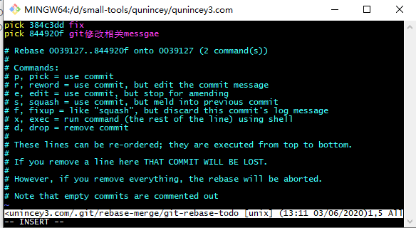

# git相关知识总结

## git add

git add .：将工作空间新增和被修改的文件添加的暂存区   
git add -u:将工作空间被修改和被删除的文件添加到暂存区(不包含没有纳入Git管理的新增文件)   
git add -A：将文件的修改，文件的删除，文件的新建，添加到暂存区。

## git重命名文件

 git mv 旧文件名 新文件名 eg:  git mv readme Rename 
 实际操作过可以直接改文件名，然后走add  commit流程效果是一样的。


## git log查看日志文件

git log --oneline 把日志简化后显示
git log -n3 显示最近的3个提交信息  n后面可加任何数字
git log -n3 --oneline 最近的3个提交信息  简化显示
git log --all 查看所有分支的提交信息
git log --graph 图形化提交信息

## gitk
gitk可视化工具

## git cat-file
查看commit,tree,blob信息

git cat-file -p 53052041d76d73c0 -p 查看内容
git cat-file -t 53052041d76d73c0 -t 查看文件类型
执行完后会显示commit内容
```
tree 69e9543530ed4eed2e3ff22a264033ea12a2ad3c
parent 0039127e3da9ba20d25276f2a54af48cc8c3ad32
author qunincey@gmail.com <qunincey@gmail.com> 1590927581 +0800
committer qunincey@gmail.com <qunincey@gmail.com> 1590927581 +0800

fix
```
tree 是commit包含的树信息 parent是上一个提交信息

## commit, tree , blob
每一次提交都会生成一个commit对象，commit中每一个文件夹会生成一个树，每一个文件会生成一个blob，每一个blob和数都会对应的一个hash值，git在大部分情况下如果hash值相同（就是没有修改的情况下）都会使用同一个hash

## 删除分支

git branch -d 分支名 删除分支，当分支没有被合并的时候会报一个警告，如果确定删除可以使用   
git branch -D 分支名

## 修改提交信息

git commit --amend 修改最近一次commit信息
修改最近几次的commit
git rebase -i gitcommit的hash值(选择你要修改的commit的上一个提交)
弹出交互式界面，如下图:    
   
讲要修改的提交前的pick改为reword或者r，保存并退出，git会自动弹出下一个编辑提交信息的界面

## 合并提交信息

git rebase -i gitcommit的hash值(选择你要修改的commit的上一个提交)
同样需要打开交互是界面，讲pick改为squash即可，注意无论合并几个，都要留一个你想要的提交写出pick，保存并退出，git会自动弹出下一个编辑合并后提交的信息

## 比较暂存区和HEAD文件的差异

git diff --cached

## 比较暂存区和工作区之间的差异

git diff 
git diff -- 具体文件名  查看具体文件差异

## git reset命令

git reset HEAD 让暂存区回复和HEAD一样的状态，这里的恢复不是删除或者还原文件，只是将暂存区的文件还原回工作区
git reset HEAD 文件名  单独还原某一个文件

git reset 有三个参数
--soft 这个只是把 HEAD 指向的 commit 恢复到你指定的 commit，暂存区 工作区不变
--hard 这个是 把 HEAD， 暂存区， 工作区 都修改为 你指定的 commit 的时候的文件状态
--mixed 这个是不加时候的默认参数，把 HEAD，暂存区 修改为 你指定的 commit 的时候的文件状态，工作区保持不变

## git stash
git stash 将工作区的变更保存
git stash 查看储藏的列表
